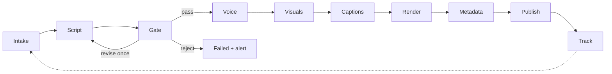

# Architecture — how an idea becomes a published video with nobody watching

This document describes the system independent of which paid or free provider sits behind each step.
Provider choices, prices and quotas live in `docs/RESEARCH.md` and `docs/DISTRIBUTION.md`; the four
end-to-end concepts that combine them live in `docs/PROJECT_PLAN.md`.

## 1. Design principles

- **One job file is the only state.** Every video is a folder under `output/<id>/` with a `job.json` that
  validates against `examples/script-schema.json` plus a `state` field. Every stage reads it, does one
  thing, and writes it back. There is no database to lose and any run can be resumed from any stage.
- **Every stage is idempotent.** Running a stage twice produces the same result and never double-spends:
  voice, images and clips are cached by a hash of their input, and a publish checks for an existing
  `remote_id` before uploading.
- **Providers sit behind interfaces.** `ScriptProvider`, `VoiceProvider`, `VisualProvider`, `Renderer`,
  `Publisher`. Moving from the $0 tier to a paid tier is a config change, not a rewrite.
- **Degrade, never die.** If a premium provider fails or the budget is spent, the visual type steps down the
  ladder (`ai-video → ai-image → stock-clip → brand-card`) and the video still ships. The downgrade is logged.
- **Fail loud, fail once.** Three retries with backoff for network errors, then the job is parked as
  `failed` and the owner is told exactly which stage and why. Nothing is retried forever.
- **A budget guard sits in front of every paid call.** Daily and monthly caps in config; when a cap is hit,
  the pipeline drops to free providers automatically rather than stopping.
- **Secrets never touch the repo.** Tokens live in environment variables, the OS credential store, or the
  CI secret store. `.gitignore` already excludes the usual files.
- **Automation is the default, review is optional.** A `review_mode` setting of `none`, `notify`, or
  `approve` controls whether the owner is told, or asked, before publishing. The default is `none`.

## 2. The pipeline



### Stage by stage

| # | Stage | Reads | Writes | Fails when | On failure |
|---|---|---|---|---|---|
| 1 | **Intake** | an idea from any source, or nothing (self-feed) | `job.json` with `id`, `idea`, `pillar`, `series`, `source`; `state=queued` | malformed idea | drop with a note |
| 2 | **Script** | idea, pillar, series, the generator prompt | `title`, `hook`, `scenes[]`, `close`, `description`, `hashtags`, `safety.quotes`; `state=scripted` | JSON invalid after one retry | `failed` |
| 3 | **Gate** | the script | cheapest first: schema and stop-reason check, word count (125 to 150) and hook length, banned-phrase regex, attribution allowlist match at 0.95, a heavy-topic keyword list (ideation phrases included) that sets `sensitivity: high` and `crisis_resources: true` when it fires, safe-messaging lint on heavy topics, distinctness score (cosine distance to the last 30 scripts with a small local embedding model such as `all-MiniLM-L6-v2`, Apache-2.0, 22.7M parameters, checked on Hugging Face 2026-10-08) above the configured threshold, profanity check, a free moderation call (a flag forces `review_mode: approve` for the job, the same path as D-019), then the judge on a different model (PASS plus originality of 4 or more); a heavy topic forces `review_mode: approve` for this job (D-019); `safety.judge_verdict`, `judge_notes`; `state=gated` | `reject`, or second `revise` | `failed` + alert |
| 4 | **Voice** | scene texts, voice config | `voice/scene-N.wav` (or one file with marks), word timings when the provider returns them, measured duration (must be 45 to 60 s); `state=voiced` | provider down after retries; duration out of range | next voice provider in the list; a long script goes back to the script stage once with the measured count |
| 5 | **Visuals** | each scene's `visual` | `visuals/scene-N.mp4` or `.png` at 1080x1920; `render.tier`; `state=visualized` | provider down, budget spent, no stock match | step down the ladder for that scene only |
| 6 | **Captions** | voice files, word timings (or forced alignment if none) | `captions.ass` with 1 to 3 words per card and the emphasis words highlighted, placed in the middle band because the bottom fifth and the right rail are covered by the platforms' own controls; `state=captioned` | alignment drifts more than 300 ms | fall back to sentence-level captions |
| 7 | **Render** | visuals, voice, captions, music bed, brand bumpers | `final.mp4` (1080x1920 after scaling or padding visuals that arrive smaller, since no generator emits that size natively; 30 fps, H.264, AAC, loudness normalised), `thumb.jpg`, `render.actual_duration_s`, `render.cost_usd`; `state=rendered` | duration over the platform limit, silent gap, FFmpeg error | trim close, re-render once |
| 8 | **Metadata** | title, description, hashtags, safety flags | per-platform title/description with crisis resources appended when `crisis_resources` is true and the same block posted as the first comment after upload through `commentThreads.insert` (50 units; the Data API cannot pin a comment, so pinning is on the owner's approval checklist), the two standing footer lines, AI-disclosure flags; `state=ready` | title over 100 chars | truncate at a word boundary |
| 9 | **Publish** | `final.mp4`, metadata, platform config | `publish.<platform>.{status, remote_id, url, scheduled_for}`; `state=published` when every enabled platform is `published` or `scheduled` | platform quota, auth expiry, upload error | retry per platform; others proceed |
| 10 | **Track** | remote ids, days 3, 7, 28 (YouTube's reports omit the most recent days) | `metrics.json` and a row in `output/metrics.csv`; on day 1 also the Content ID claim status of the YouTube upload; `state=tracked` | analytics API error; a claim that blocks the video | retry next day; on a claim, replace the track from the licensed library or file the stored dispute text, and alert |

Two side states exist: `failed` (terminal, owner alerted, job kept for inspection) and `awaiting-approval`
(only in `approve` review mode; on timeout the job fails by default, a config switch may let an ordinary job
publish instead, and a job routed by the heavy-topic gate ignores that switch: it can only fail or keep
waiting, never publish, per D-019).

### What the runner does

A single command, `run`, is safe to invoke as often as you like (hourly from Windows Task Scheduler, from a
cron workflow, or by hand):

1. Intake: pull new ideas from every enabled source; if the queue is empty and self-feed is on and no job was
   created today, generate one idea.
2. For each job not in a terminal state, oldest first, run its next stage. Stop a job after three failures
   of the same stage.
3. For each published job with a due tracking day, pull metrics (with a three-day offset for YouTube).
   Also enforce the variety rules before rendering: a job whose music bed, visual set or structure
   repeats a recent video is sent back to the visuals stage with a different draw.
4. Send the daily summary if one has not been sent today.

Because every stage is idempotent, a crash halfway through leaves nothing to clean up; the next run picks
up where the last one stopped.

## 3. The visual ladder

The `visual.type` on each scene is a request, not a guarantee. The pipeline resolves it top-down, scene by
scene, so one expensive scene can sit next to five cheap ones.

| Rung | Type | What is on screen | Marginal cost per scene | Needs |
|---|---|---|---|---|
| A | `brand-card` | A branded background (gradient, texture or one of a few owned photos) with the captions as the main visual | $0 | nothing external |
| B | `stock-clip` | A licensed stock clip or photo, cropped to 9:16, with a slow push or pan | $0 | a stock API key |
| C | `ai-image` | A generated image for the scene with a Ken Burns move | cents | an image API or a local GPU |
| D | `ai-video` | A generated 5 to 8 second clip | tens of cents to dollars | a video API |
| E | hybrid | Any mix; typically C for the hook and B elsewhere | pennies to about half a dollar | both |

Rules: a scene downgrades when its provider errors twice, when the stock search returns nothing usable,
or when the budget guard says no. A job's `render.tier` records the highest rung actually used. The hook
scene is downgraded last, because it is the one that decides whether anyone watches.

## 4. Captions

Captions are the product at the $0 tier, so they get their own stage.

- **Timing source, in order of preference:** word timestamps from the voice provider (Kokoro-FastAPI's
  captioned endpoint at the $0 tier; ElevenLabs' character timings or Azure's word-boundary events on
  paid voices; Google's newest voices give none), then forced alignment of the voice file against the
  known script text with `faster-whisper` (fast and accurate because the text is known), then plain
  transcription as a last resort. Details and sources in `docs/RESEARCH.md` section 4.
- **Style:** one to three words per card, centred in the lower-middle third, large sans-serif, high
  contrast, the `caption_emphasis` words in the brand accent colour. A card never covers a face.
- **Output:** an ASS subtitle file burned in by the renderer. ASS keeps styling deterministic and works
  on every platform without a Node toolchain. A Remotion template is the upgrade path when animated
  captions are wanted. On Windows the renderer passes the subtitle path relative to the job folder (an
  absolute path needs its drive-letter colon escaped in the filter string) and points `fontsdir` at the
  bundled fonts so no system font configuration is needed.
- **Checks:** total caption duration equals voice duration within 300 ms; no card shorter than 250 ms; no
  card longer than 2.5 s.

## 5. Render

- Canvas 1080x1920, 30 fps, H.264 high profile, AAC 192 kbps, loudness normalised to around -14 LUFS so
  every video sounds the same on a phone.
- Timeline: 0.3 s brand bumper, scenes cut on voice boundaries with a 0.2 s crossfade, 0.5 s hold on the
  last frame, optional 0.5 s end card. Music bed ducked under the voice.
- Hard limits are configuration, not code: `max_duration_s` defaults to 60 so a video qualifies as a Short
  on every platform regardless of the current YouTube limit (see `docs/DISTRIBUTION.md`).
- The thumbnail is the hook frame with the title overlaid; most platforms ignore it for shorts, and
  YouTube only opened custom Shorts thumbnails to Partner Program channels in July 2026, so it is saved
  but nothing depends on it.
- A dry-run flag renders everything and publishes nothing. It is the default in development.

## 6. Publishing

Each platform is an adapter with the same three methods: `authenticate`, `upload(job) -> remote_id`,
`status(remote_id)`. Adapters are independent; a TikTok failure never blocks YouTube.

A **distribution ledger** sits under every adapter: per-platform daily counters (Instagram 100,
Facebook 30, Threads 250, TikTok 15, Bluesky 25, YouTube 100), token expiry dates with a refresh job
(Meta's long-lived tokens last 60 days), the platform-specific waits (Threads asks for about 30 seconds
between creating and publishing a container), and every remote post id, so a re-run never double-posts.
Rendered files that a platform fetches by URL are copied to public object storage behind the owner's
domain for the few minutes the publish takes.

Two ways to reach the long tail of platforms, both designed in:

- **Direct APIs** for the platforms that matter most and whose APIs are workable for a single developer
  (YouTube first). The YouTube adapter sends every field in the single insert call, because updates and
  thumbnail sets cost 50 quota units each and an update that omits a field deletes it.
- **A scheduler or aggregator** (self-hosted or paid) that takes one upload and fans it out, for platforms
  whose own APIs demand an app review that is not worth it for one channel.

Scheduling: the pipeline can publish immediately or hand a `publishAt` time to the platform. The default is
one slot per day in the owner's time zone so the channel has a rhythm viewers can learn.

## 7. Intake sources

All sources produce the same thing: an idea string, an optional pillar and series, and a `source` tag.

| Source | How it triggers | Good for |
|---|---|---|
| GitHub issue form with the `idea` label (**the one queue**) | a workflow on `issues.opened` parses the form body, runs the pipeline, comments the video URL and closes the issue | phone-friendly, free, auditable; every other source opens one of these |
| CLI (`new "idea"`) | immediate, opens an issue when online | testing, bulk loading |
| Telegram bot | the runner long-polls `getUpdates` from the PC (no public endpoint) and opens an issue | fastest from a phone |
| Google Sheet | an Apps Script trigger opens an issue when a row's status is `ready` | planning a week at once |
| Email to a label | the runner polls the label via IMAP or the Gmail API and opens an issue | low-tech |
| Notion, Airtable, forms | through a small relay (a Cloudflare Worker calling `repository_dispatch`) or polling | only if already in use |
| Self-feed | once a day when no human idea is pending: the pillar rotation and calendar hooks from `docs/CONTENT_STRATEGY.md` section 2, the last 30 ideas shown to the generator, one idea returned, the distinctness gate as the diversity check; opened as an issue | 100 percent automation |

## 8. Hosting shapes

The runner is one process with FFmpeg and Python on the path. It has no GPU requirement at rungs A to C
when image generation is an API call, and a host without a GPU can borrow one: a free Hugging Face
account can call shared ZeroGPU Spaces for five minutes a day through the Gradio API, host two such
Spaces of its own, or route to fal and Replicate through Inference Providers with one token
(`docs/RESEARCH.md` section 12). Five shapes, detailed in `docs/PROJECT_PLAN.md` (the PC is Concept 1 there, GitHub Actions Concept 2,
n8n Concept 3, the always-on box hosts Concept 4, and GPU bursts serve any of them):

1. **Owner's Windows PC** with Task Scheduler (`/ru System`). $0; the development runner and manual
   backup. Sleep, update reboots and password changes skip runs, so it is not the production scheduler.
2. **GitHub Actions** on a schedule in a private repository: the scheduler of record from phase 3. $0
   within 2,000 minutes a month, stateless, so the queue and results are committed back with the job's
   own token (which cannot trigger another workflow) and media go to workflow artifacts and public
   object storage. Secrets in the Actions secret store; FFmpeg installed each run; no GPU.
3. **GPU bursts** on Modal (`modal.Cron`, $30 a month of free credit, per-second billing) or Hugging
   Face Jobs (cron, cents an hour for CPU, $0.40 an hour for a T4) for any stage that needs one.
4. **A small always-on box** (Raspberry Pi, mini PC, or a $6 VPS) running the same runner from cron, if
   a host that is neither the PC nor GitHub is ever wanted.
5. **n8n** (self-hosted) orchestrating the same stages as nodes, when a visual canvas is preferred.

## 9. Observability and control

- One log line per stage per job with elapsed time and cost; `output/metrics.csv` for the feedback loop.
- A daily summary message (Telegram, Discord webhook or email): jobs made, published, failed, spend to date.
- A `PAUSE` file (or env var) stops publishing but keeps rendering, for when something looks wrong.
- A dead-man's switch: the last step of every run pings a free healthchecks.io check, so a scheduler
  that silently never fires (the PC asleep, a disabled workflow) is reported within a day.
- `review_mode=approve` posts the rendered video to the owner and waits for a reaction; on timeout the
  job fails by default, and the switch that lets it publish instead never applies to a heavy-topic job
  (D-019).

## 10. Repository layout once code exists

```
headless-youtube/
  docs/                 plan, research, decisions, journal
  examples/             schema, sample script, prompt templates
  src/hy/               the runner: intake/, stages/, providers/, publishers/, render/
  assets/               brand cards, fonts, music bed (licensed), bumpers
  config/               pipeline.yaml (providers, tiers, budget, review_mode), platforms.yaml
  queue/                ideas waiting (only when hosted on GitHub Actions)
  output/               one folder per job (git-ignored)
  tests/                golden sample render, schema tests, adapter contract tests
```

## 11. Language choice

The reference implementation is Python 3.12 because every AI, speech, and platform SDK that matters ships
a Python client first, and FFmpeg is called the same way from anywhere. The owner's .NET background is not
wasted: a .NET runner using FFMpegCore and the Google YouTube client would work for rungs A and B, and is
noted as an option in `docs/DECISIONS.md`. Remotion (Node) is an optional renderer for animated captions,
not a requirement.

## 12. Things this design deliberately does not do

- No web dashboard in version one. The job folders and the daily summary are the dashboard.
- No database. The job files and one CSV are enough until there are thousands of videos.
- No voice cloning of the owner in version one; a consistent licensed AI voice is simpler and safer.
- No comment replies or community management; that is a different product. The only comment features
  are posting the crisis block as the first comment on heavy videos and the one-time Studio
  hold-for-review setting.
